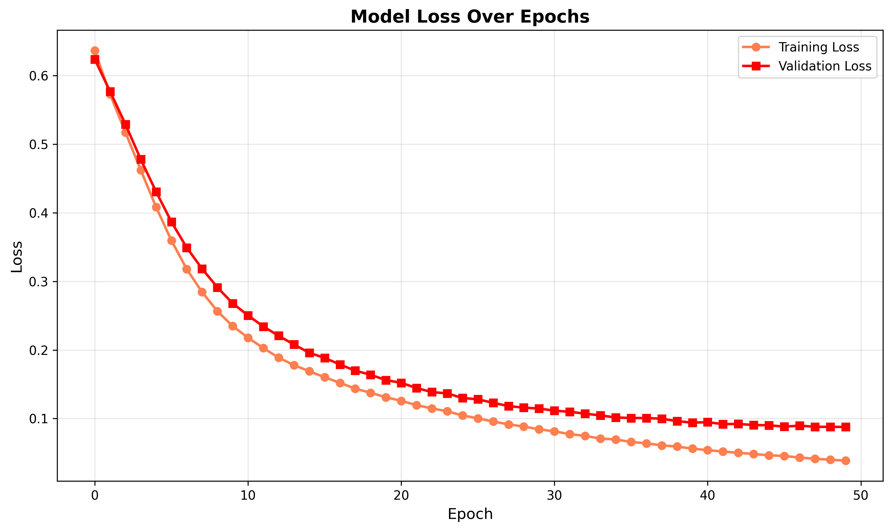
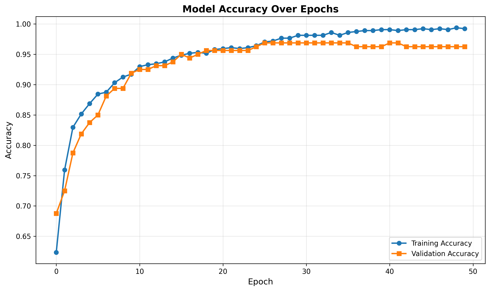
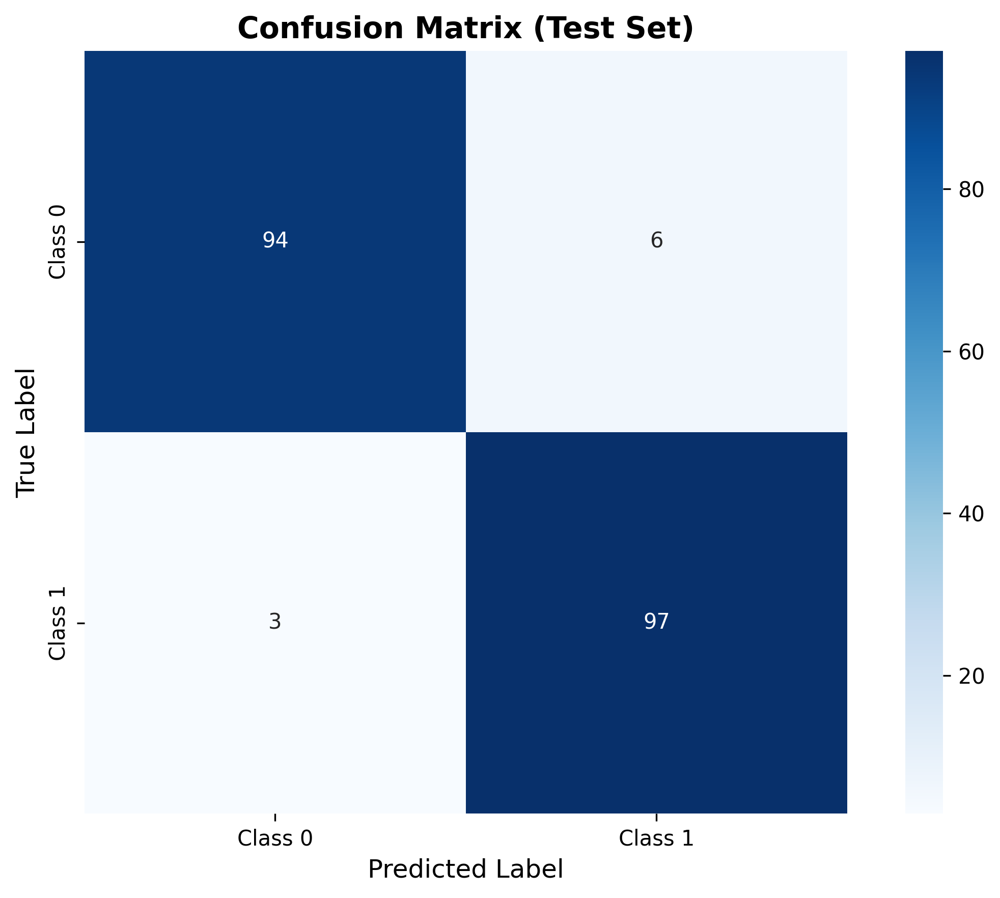

# 🧠 Neural Network Template: Keras & TensorFlow

## 🚀 Project Overview
**Developed a Deep Learning template using the Keras Sequential API to build, train, and evaluate Multi-Layer Perceptrons (MLP) for classification tasks.**

This framework serves as an entry point into neural computing. It automates the construction of dense layers, activation functions (ReLU/Sigmoid), and compilation strategies (Adam optimizer). Crucially, it implements **Validation Splits** to monitor learning in real-time, allowing for the detection and prevention of overfitting.

---

## 📊 Key Results & Visualizations

### 1. Learning Curves: Loss over Epochs
This critical plot tracks the "Loss" (error rate) for both the training and validation sets over time. It is the primary tool for diagnosing model health (e.g., identifying when the model stops learning or starts memorizing/overfitting).

### 2. Accuracy over Epochs
Visualizing the improvement in classification accuracy as the network updates its weights during training.

### 3. Test Set Performance
The final evaluation on the held-out test set, displayed as a Confusion Matrix to show specific class performance.

---

## 🛠 Tech Stack
* **Language:** Python 3.9+
* **Deep Learning:** TensorFlow, Keras
* **Preprocessing:** Scikit-learn (StandardScaler)
* **Visualization:** Matplotlib, Seaborn

---

## 🔒 Source Code Access
*This repository serves as a showcase of the project's methodology and results.*

Due to the proprietary nature of the implementation (or data sensitivity), the full source code is stored in a private repository. However, detailed code walkthroughs and architecture discussions are available upon request for interviewers.
